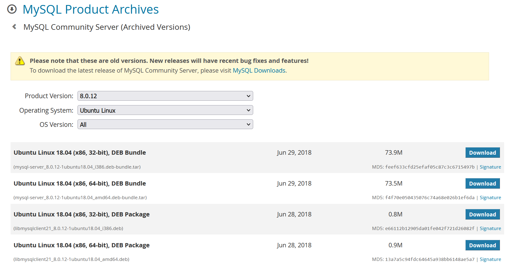
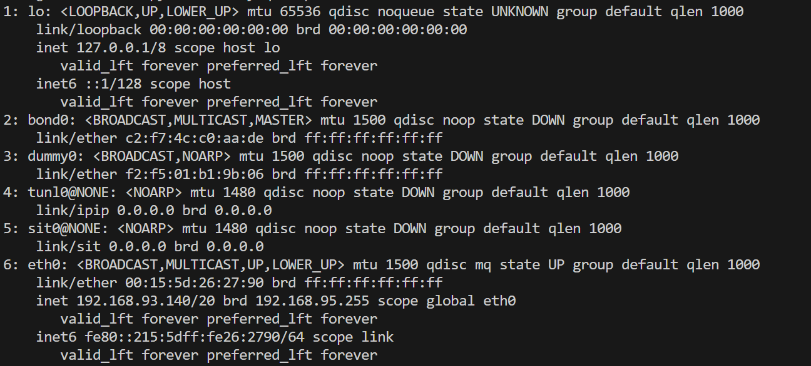
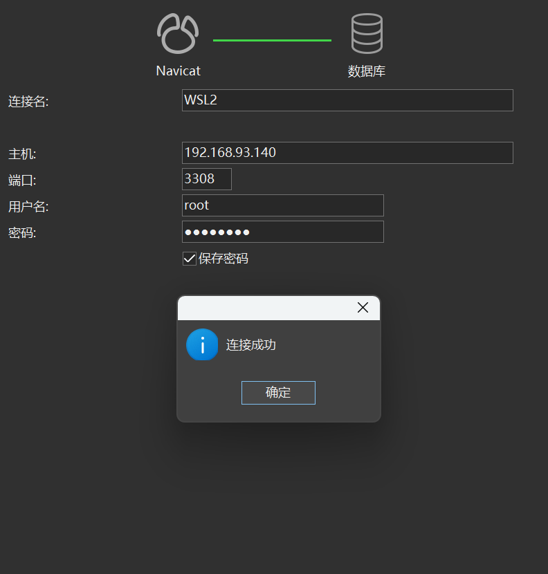

# WSL2(Ubuntu18)离线安装MySQL8.0.11
- 关闭本地MySQL，避免占用相同的3306端口，后续安装注意修改WSL2的端口

- [下载对应版本](https://downloads.mysql.com/archives/community/)，注意检查32/64
  - 其中Ubuntu18不支持最新的8.0.33
  - 
  - 复制下载链接
    ``` bash
    wget https://downloads.mysql.com/archives/get/p/23/file/mysql-server_8.0.12-1ubuntu18.04_amd64.deb-bundle.tar
    ```
- 解压缩
``` bash
tar -xvf mysql-server_8.0.12-1ubuntu18.04_amd64.deb-bundle.tar
```
- 顺序安装
``` bash
mysql-common_8.0.12-1ubuntu18.04_amd64.deb
mysql-community-client-plugins_8.0.12-1ubuntu18.04_amd64.deb
libmysqlclient21_8.0.12-1ubuntu18.04_amd64.deb
libmysqlclient-dev_8.0.12-1ubuntu18.04_amd64.deb
mysql-community-client-core_8.0.12-1ubuntu18.04_amd64.deb
mysql-community-client-core_8.0.12-1ubuntu18.04_amd64.deb
mysql-community-client_8.0.12-1ubuntu18.04_amd64.deb
mysql-client_8.0.12-1ubuntu18.04_amd64.deb
mysql-community-server_8.0.12-1ubuntu18.04_amd64.deb

```


## 问题解决

### 安装过程会输入两次密码，然后提示选择加密方式，请选择第二个5.7.X

### 缺少依赖：libaio1、libmecab2
> apt-get install libaio1 出现
> 
> Reading package lists... Done
Building dependency tree       
Reading state information... Done
You might want to run 'apt --fix-broken install' to correct these.
The following packages have unmet dependencies:
 mysql-community-server : Depends: mysql-client (= 8.0.11-1ubuntu18.04) but it is not going to be installed
                          Depends: libmecab2 but it is not going to be installed
 mysql-community-server-core : Depends: libmecab2 but it is not going to be installed
                               Recommends: mecab-ipadic-utf8 but it is not going to be installed
E: Unmet dependencies. Try 'apt --fix-broken install' with no packages (or specify a solution).
- apt --fix-broken install


### 进入mysql
``` bash
mysql -uroot -p
```
> ERROR 2002 (HY000): Can't connect to local MySQL server through socket '/var/run/mysqld/mysqld.sock' (2)

- 查看mysql状态应该是未运行
``` bash
service mysql status
MySQL Community Server 8.0.11 is not running
```
- 启动mysql

``` bash
sudo service mysql start

No directory, logging in with HOME=/mkdir: cannot create directory ‘//.cache’: Permission denied

/etc/profile.d/wsl-integration.sh: line 19: //.cache/wslu/integration: No such file or directory

```
- 重启mysql

``` bash
sudo service mysql stop
sudo usermod -d /var/lib/mysql/ mysql
sudo service mysql start
```
- 成功进入

``` bash
mysql -uroot -p 
```


### 授权远程访问

``` bash
sudo service mysql stop
```

* 切到 /etc/mysql/my.cnf/mysql.conf.d路径下 打开 mysqld.cnf 文件（默认配置文件）
修改如下

``` bash

port           =3308
bind-address   =0.0.0.0
```

* 进入数据库

``` bash
sudo service mysql start

mysql> use mysql;
mysql> GRANT ALL PRIVILEGES ON *.* TO 'root'@'%' WITH GRANT OPTION;
mysql> FLUSH PRIVILEGES;
```
* 查看ip地址,eth0就是，如图为192.168.93.140

``` bash
ip addr
```



### navicat


## 书籍资料
- [SQL 必知必会(Sams Teach Yourself SQL in 10 Minutes_5th)](https://gitcode.net/e-books/books_abt_python3/-/blob/master/SQL%E5%BF%85%E7%9F%A5%E5%BF%85%E4%BC%9A%EF%BC%88%E7%AC%AC5%E7%89%88.pdf)
- [在线阅读2](https://yun.weicheng.men/Book/SQL%E5%BF%85%E7%9F%A5%E5%BF%85%E4%BC%9A.%E7%AC%AC4%E7%89%88.pdf)
- [SQL进阶教程](https://yun.weicheng.men/Book/SQL%E8%BF%9B%E9%98%B6%E6%95%99%E7%A8%8B.pdf)
## TODO