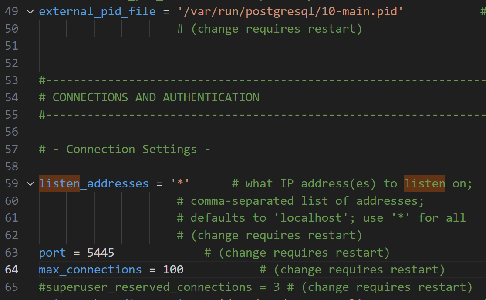
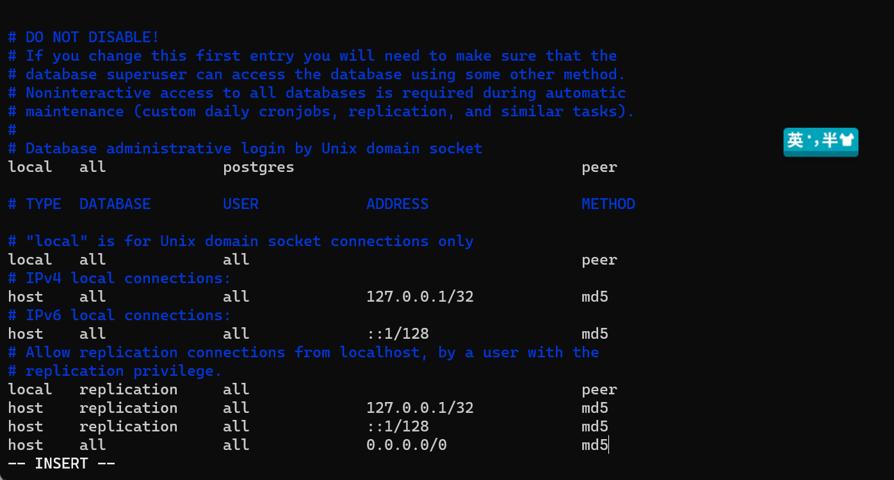
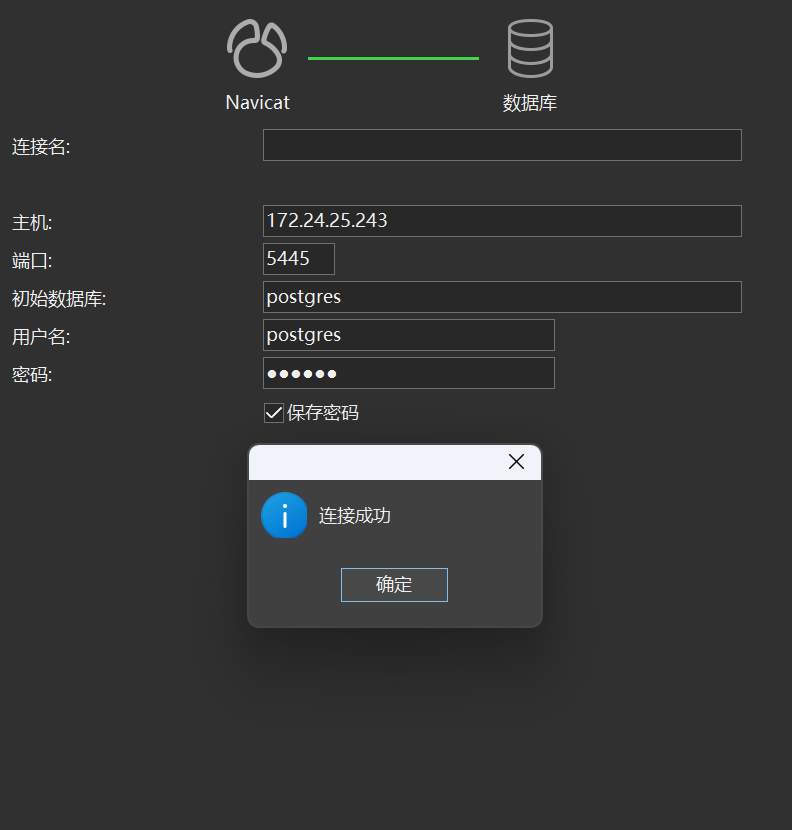

# WSL2(Ubuntu18)安装Postgresql
## install
``` bash
sudo apt install postgresql postgresql-contrib
```
## start service
``` bash
sudo service postgresql status
sudo service postgresql restart
```
## connect 
``` bash
sudo su - postgres
```
## using psql in 
``` bash
postgres@sean:~$ psql
psql (10.23 (Ubuntu 10.23-0ubuntu0.18.04.2))
Type "help" for help.

```

### 一些常用命令

* To list all databases in PostgreSQL we can use \l command.
* 
* To list all users in PostgreSQL we can use \du command.
* 
* To exit from psql we can use \q command.
* 
* To exit from postgres user type exit or CTRL+D
``` bash
create database testdb owner test;
create user test with password 'test';
```
## 启用远程连接
- 修改 postgresql.conf，取消注释
``` bash
vim /etc/postgresql/10/main/postgresql.conf
```

``` bash
vim /etc/postgresql/10/main/pg_hba.conf
```


- 连接结果


# QA
## 更改port
- windows下查找postgresql.conf，修改port，重启服务
- 打开pgadmin需要再菜单栏，Object-->properties-->修改Connection中的port