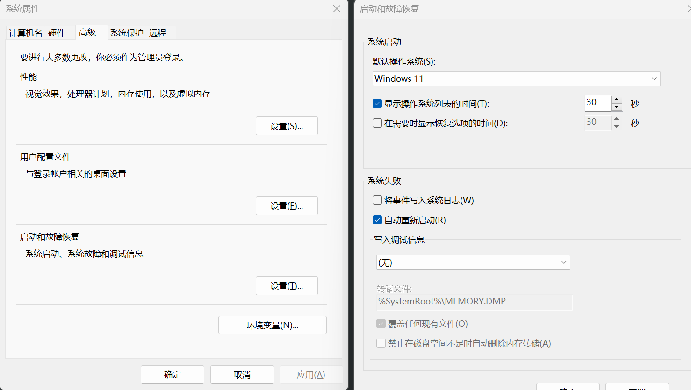
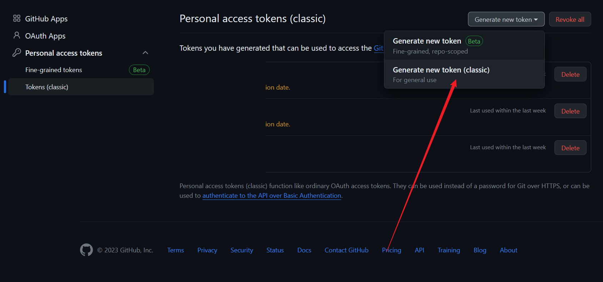
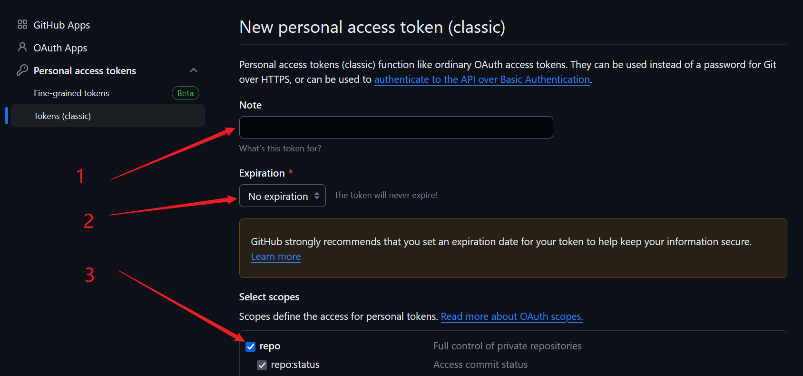
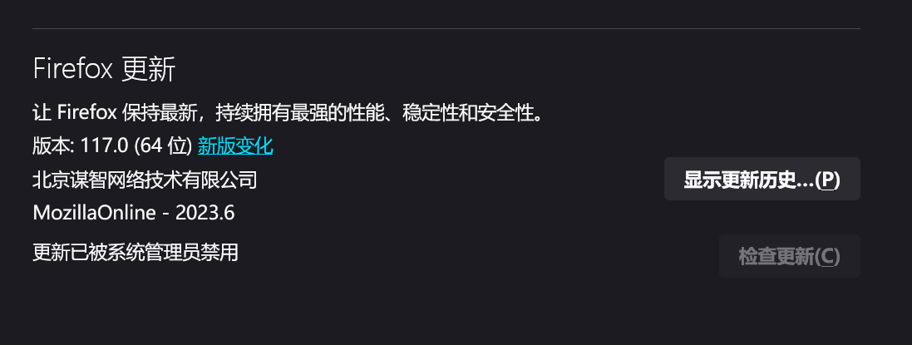

# Windows优化
## c盘存储优化
- 取消错误信息日志

- 移动桌面，下载，文档等库的文件夹位置到其他盘
- pip 缓存目录
``` bash
pip config set global.cache-dir "E:/pipcache"
```
- conda 缓存目录以及默认envs目录设置

.condarc文件内容
``` yaml
channels:
  - defaults
  - conda-forge
show_channel_urls: true
default_channels:
  - https://mirrors.tuna.tsinghua.edu.cn/anaconda/pkgs/main
  - https://mirrors.tuna.tsinghua.edu.cn/anaconda/pkgs/r
  - https://mirrors.tuna.tsinghua.edu.cn/anaconda/pkgs/msys2
custom_channels:
  conda-forge: https://mirrors.tuna.tsinghua.edu.cn/anaconda/cloud
  msys2: https://mirrors.tuna.tsinghua.edu.cn/anaconda/cloud
  bioconda: https://mirrors.tuna.tsinghua.edu.cn/anaconda/cloud
  menpo: https://mirrors.tuna.tsinghua.edu.cn/anaconda/cloud
  pytorch: https://mirrors.tuna.tsinghua.edu.cn/anaconda/cloud
  pytorch-lts: https://mirrors.tuna.tsinghua.edu.cn/anaconda/cloud
  simpleitk: https://mirrors.tuna.tsinghua.edu.cn/anaconda/cloud
pkgs_dirs:
  - E:\condacache
  - C:\Users\x\miniconda3\pkgs
  - C:\Users\x\.conda\pkgs
  - C:\Users\x\AppData\Local\conda\conda\pkgs
envs_dirs:
  - E:\PythonCode
  - C:\Users\x\miniconda3\envs
  - C:\Users\x\.conda\envs
  - C:\Users\x\AppData\Local\conda\conda\envs
```
## 图床
- github设置
  - [打开链接](https://github.com/settings/tokens/new)
  - 
  - 

- PicGo设置
  - 下载后从任务栏隐藏的图标中找到
  - 配置gihub图床如下，将个人token填入即可，仓库名为github用户名/项目名称
  - 例如github的公开项目地址为https://github.com/myname/mypic，那么仓库名就是myname/mypic
  - 


# FireFox优化
- 禁止更新，在管理员身份运行下的cmd窗口，运行下面命令

``` bash
reg add "HKEY_LOCAL_MACHINE\SOFTWARE\Policies\Mozilla\Firefox" /v DisableAppUpdate /t REG_DWORD /d 1 /f
```
- 效果，更新按钮不可用


# powershell 设置别名 alias
- Get-Variable Profile
- New-Item -Type file -Force $profile
## 打开 profile文件所在路径，例如` E:\Documents\WindowsPowerShell\Microsoft.PowerShell_profile.ps1`
- 输入命令
``` python
function ccc { conda activate py37 }
function pp { pip list }
function pi { pip install }
function pf { pip freeze > r.txt }
```
  