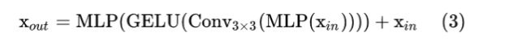

# 常见的神经网络

# Torch

<h2 style="color: #ed7d31">Torch中的基本元素</h2>

``` python
import torch.nn as nn
```

### nn.Conv2d
#### 参数组合对尺寸的影响

- 常用参数 kernel_size,stride,padding,dilation，[原文链接](https://blog.csdn.net/Brikie/article/details/112313143)
- 卷积层输出尺寸： o = ⌊(i + 2p - k) / s⌋ + 1
式中，i:输入尺寸；o:输出尺寸；p:padding；k: kernel_size；s: stride。⌊…⌋表示向下取整。

- 推导过程
- 这个公式不用死记，下面我用非常便于理解的方法描述这个推导。卷积就是对相邻的一片数据进行加权求和得到一个数的一种“合并”操作，将此操作对输入张量进行滑动扫描以得到输出张量。循着这个过程，我们很容易推导出卷积输出尺寸的计算公式。
- 1）注意padding指的是两边同时补零，所以补零后输入尺寸相当于变成了i+2p；
- 2）用卷积核扫描的时候，想象一把尺子在桌子上从左移动到右，受到左右边框的界限，它的移动范围只有i+2p-k大小。
- 3）如果每次移动的步长是s，实际上移动的步数就是 (i+2p-k)/s，但移动的步数必须是整数，因为不能出界，如果最后一步哪怕还差一点也不能算，所以必须要向下取整。
- 4）即使一步不移动，也会在原位得到一个输出点，所以最后得到的输出尺寸是移动的总步数再加上1。
- 当存在dilation的时候，只会改变k的大小
- 此时k=dilation*(kernel_size-1) + 1

#### 常用的参数设置
```{warning}
不会改变尺寸,dilation=1
```
- kernel_size=3,stride=1,padding=1
- 1,1,0
```{warning}
不会改变尺寸,dilation=6,参考自deeplab，不同卷积率并行提取特征
```
- 3,1,6
- 3,1,12,12
- 3,1,18,18

> 尺寸减半,dilation=1
- 5,2,2
- 7,2,3
> 尺寸减半,dilation=2
- 3,2,2
- 5,2,4
- 7,2,6
> dilation=3
- 3,2,3
- 5,2,6
- 7,2,9
### nn.BatchNorm2d


### nn.ReLU
### nn.Sequential

### grad
- 梯度就是对函数导数，梯度值就是函数在某一点的导数值，这里的某一点可以理解为图片的像素值
``` python
import torch
import torch.nn as nn
x = torch.tensor([[1.0, 2.0], [3.0, 4.0]], requires_grad=True)

# 定义一个函数，用于计算矩阵的某个元素的平方和
y = (x ** 2).sum()

# 计算梯度
y.backward()

# 打印梯度
print(x.grad)# tensor([[2., 4.],[6., 8.]])
```

> 对第一个点的计算方式为，y=x**2+4+9+16,在x=1处的导数是2;

> 第二个点，y=x**2+1+9+16,在x=2处导数为4;

<h3 style="color: #ed7d31">如果函数表达式改变</h3>

``` python
import torch
import torch.nn as nn
x = torch.tensor([[1.0, 2.0], [3.0, 4.0]], requires_grad=True)

# 定义一个函数 prod为乘积
y = (x ** 2).prod()

# 计算梯度
y.backward()

# 打印梯度
print(x.grad)# tensor([[1152.,  576.],[ 384.,  288.]])
```
> 计算方法，对第一个元素，`y=x**2*(4*9*16)`,求导结果是`(4*9*16)*2*x`,其余以此类推

